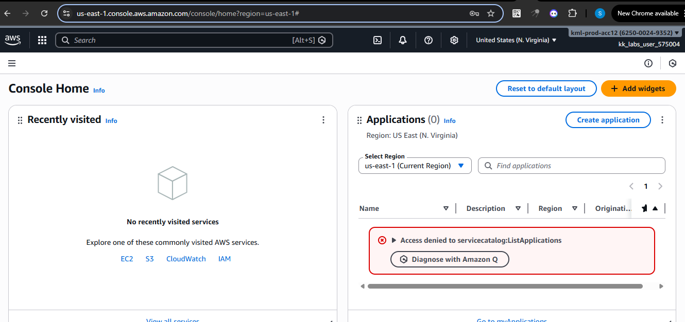
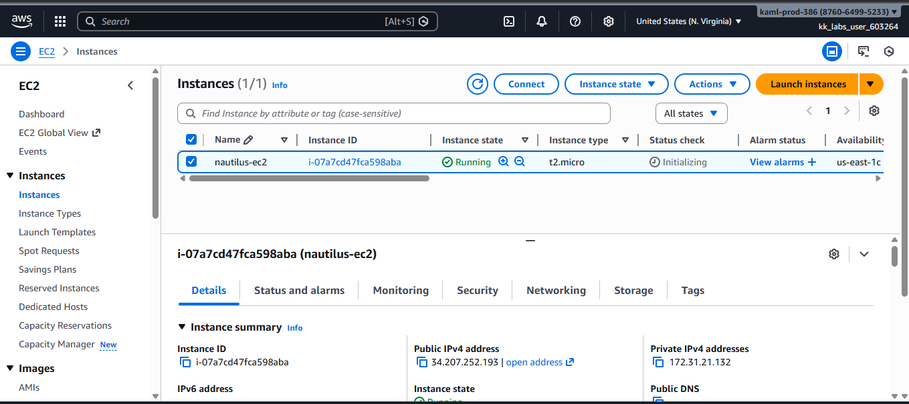
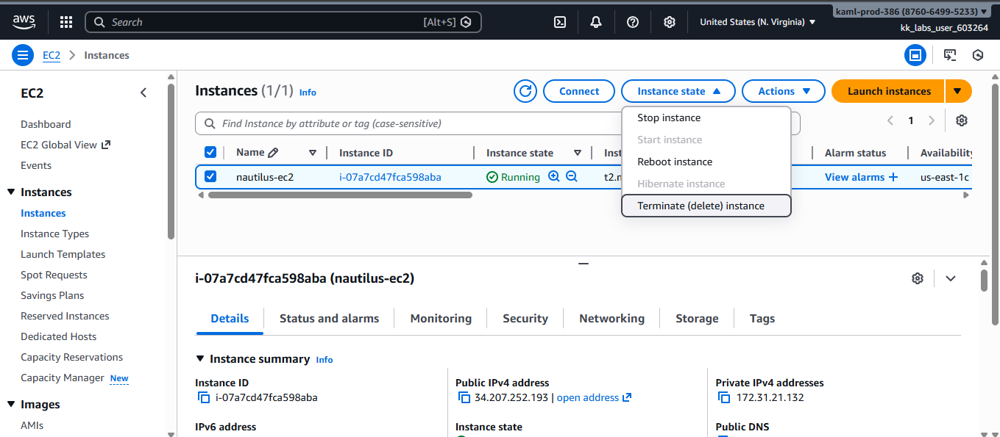
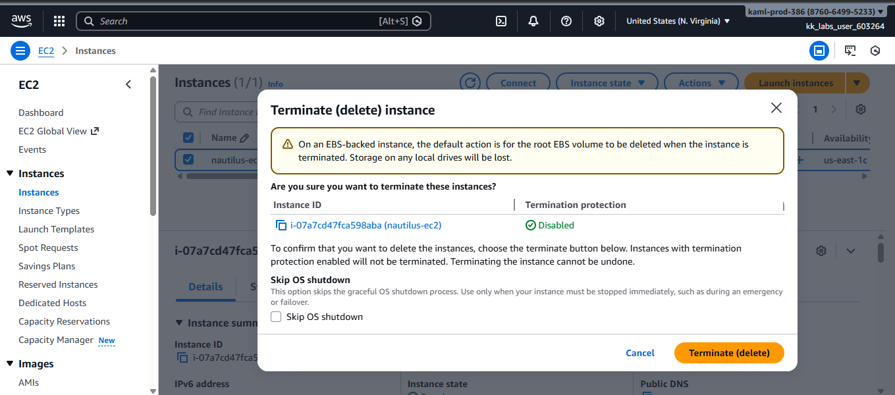
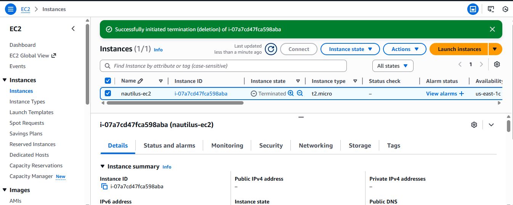

# Delete-an-Obsolete-EC2-Instance

This guide demonstrates how to delete an existing **Amazon EC2 instance** using the **AWS Management Console**.  
Terminating unused instances is an important cloud hygiene practice. It helps reduce unnecessary costs, eliminate unused compute resources, and minimize potential security exposure.

## Step 1: Log in to AWS Console

1. Go to https://console.aws.amazon.com  
2. Sign in with your credentials.
   

## Step 2: Navigate to EC2

1. Search for **EC2** in the AWS search bar.
2. Click **EC2**.
3. In the left panel, click **Instances** → **Instances**.

## Step 3: Locate the Instance

1. Confirm the instance name and region.
2. Ensure it is the correct instance before proceeding.

## Step 4: Terminate the Instance

1. Click **Instance state**.
2. Select **Terminate instance**.
3. Confirm termination.
   

## Step 5: Verify Terminated State

1. After termination, the instance state will change:
Running → Shutting-down → Terminated
2. Ensure the final state shows: Terminated

## Why This Matters

Terminating obsolete EC2 instances ensures:
- Reduced unnecessary cloud costs  
- Cleaner and organized infrastructure  
- Minimized security risks from unused resources  
- Improved overall cloud hygiene and operational efficiency

